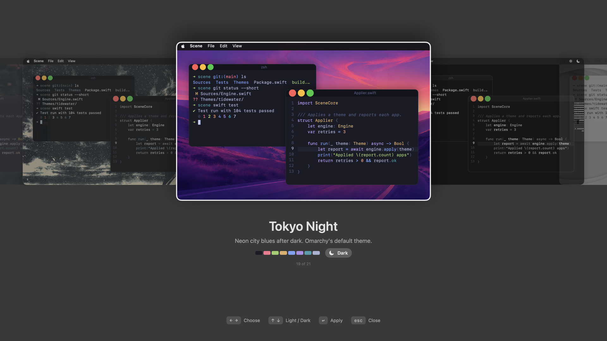
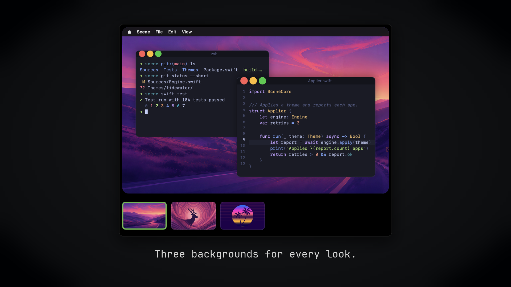
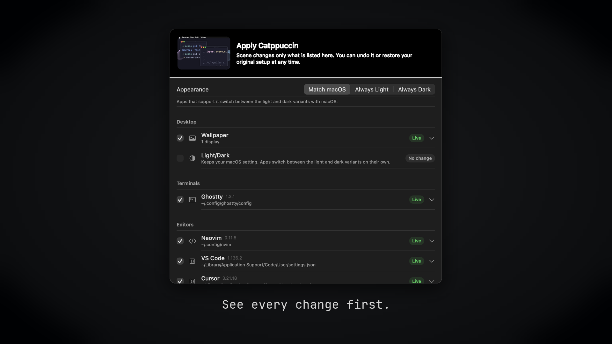
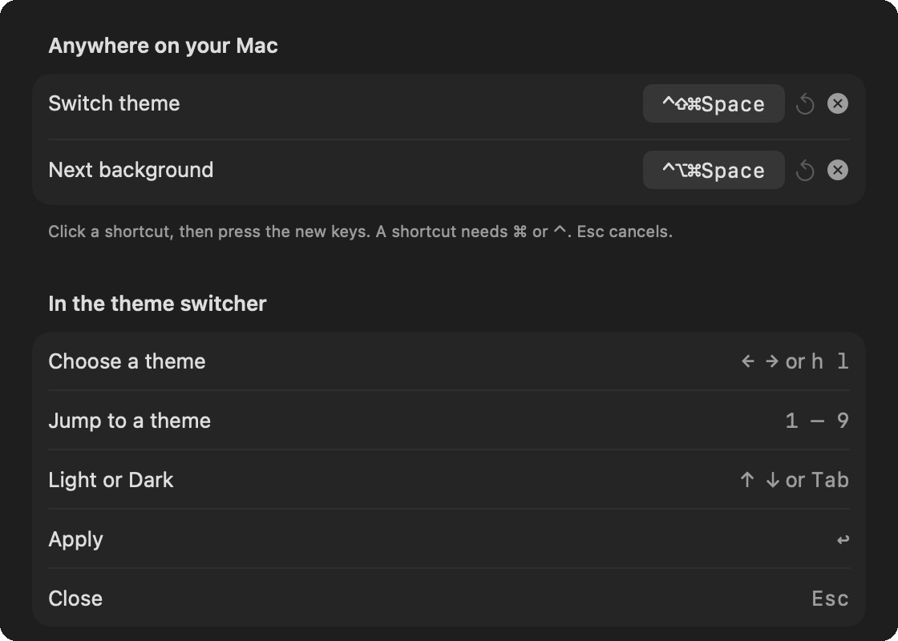

<h1 align="center">Scene</h1>

<h3 align="center">One theme for your whole Mac.</h3>

<p align="center">
  
</p>

Scene gives your desktop, terminals, and code editors one theme in one step, the way [Omarchy](https://omarchy.org) does on Linux. It changes the wallpaper, Light/Dark, the accent color, Ghostty, iTerm2, VS Code, Cursor, and Neovim together, and it can put your original setup back.

## Switch from anywhere

Press ⌃⇧⌘Space to show your themes over every screen. It is Omarchy's theme menu key, with ⌘ as Super. ← → choose a theme, ↑ ↓ switch between Light and Dark, ↩ applies it, and Esc closes.

## Three backgrounds for every look

<p align="center">
  
</p>

Each theme has three backgrounds for its dark look and three for its light look. Pick one on the theme's page. Press ⌃⌥⌘Space to show the next one, like Omarchy's Super + Ctrl + Space. It changes only the wallpaper, and Undo brings the last one back.

## See every change first

<p align="center">
  
</p>

Before a theme touches anything, Scene lists each app and every file and setting it will change. Turn an app off to leave it alone. Undo goes back to the previous theme. Restore Original Setup puts back everything Scene changed and keeps the changes you made yourself.

## What it themes

| | Apps | How |
|---|---|---|
| Desktop | Wallpaper, Light/Dark | `NSWorkspace`; System Events, or a private call |
| macOS look | Accent color, icon & widget style | Private calls in a helper, on tested macOS builds only (experimental) |
| Terminals | Ghostty, iTerm2 | A Scene theme file and one marked include line; an iTerm2 Dynamic Profile |
| Editors | VS Code, Cursor, VSCodium, Windsurf, Neovim | A generated theme extension and a comment-preserving settings edit; a Neovim plugin file and a JSON data file |

Slack, Discord, Safari, and Chrome cannot be themed by other apps. Set them to follow the system, and they switch with Light/Dark.

## Install

There is no download yet. Build Scene from a clone:

```sh
git clone https://github.com/InsaneArts/Scene.git
cd Scene
./Scripts/package_app.sh
open build/Scene.app
```

Requirements:

- macOS 14 or newer
- Xcode 26 or newer, to build
- For accent color and icon style, a macOS build that Scene has tested (now macOS 26.6.2). Settings can allow other builds.

Scene keeps running after you close its window, so the shortcuts keep working. Turn on Open Scene at login in Settings to keep them after a restart.

## Remove

1. In Scene, open History and click Restore Original Setup.
2. In Settings, turn off Open Scene at login. Then quit Scene and delete it.
3. Delete its data and settings:

```sh
rm -rf ~/Library/Application\ Support/Scene
defaults delete com.insanearts.scene
```

## Using it

- Double-click a theme, or select it and click Apply…, to see the plan and apply it.
- ⌥⌘Z undoes the last theme.
- The Apps page shows what Scene found on your Mac. Stop Managing restores one app and leaves it out of later themes.
- Import a `.scenetheme` file, a theme folder, or an Omarchy theme folder with the import button in the toolbar.
- Turn on the menu bar icon in Settings to switch themes from the menu bar.

## Settings



Open Settings with ⌘, or the gear in the toolbar. Record, reset, or turn off each shortcut. The Shortcuts tab also lists the switcher's keys. Apps chooses which apps a theme changes. Open at login and the menu bar icon are under General. The private macOS calls for accent color, icon style, and Light/Dark are under Experimental.

<br clear="right" />

## Themes

Scene comes with 21 themes built from Omarchy's palettes, from Tokyo Night to Catppuccin, Gruvbox, and Rosé Pine. A theme is a folder or a `.scenetheme` zip with `theme.json`, `wallpapers/`, and optional `apps/` overrides. Themes are data only: Scene never runs code from a theme. Importing an Omarchy theme folder takes its colors and backgrounds and ignores everything else.

The backgrounds come from Omarchy and r/unixporn. `Themes/WALLPAPER_SOURCES.json` lists where each one comes from and what is known about its license. Most licenses are unknown, so check image rights before you distribute the app.

## Development

```sh
open Scene.xcodeproj    # ⌘R runs the app, ⌘U runs the tests
./Scripts/test.sh       # the same 120 tests from the command line
```

The core is a local package, `Packages/SceneKit`. [docs/development.md](docs/development.md) has the layout, the release steps, and what was tested on a real Mac. [docs/research-and-architecture.md](docs/research-and-architecture.md) has the design.

## Credits

Palettes: [Omarchy](https://github.com/omacom/omarchy) v4.0.4 (MIT), [rose-pine/palette](https://github.com/rose-pine/palette), and [sainnhe/gruvbox-material](https://github.com/sainnhe/gruvbox-material).
