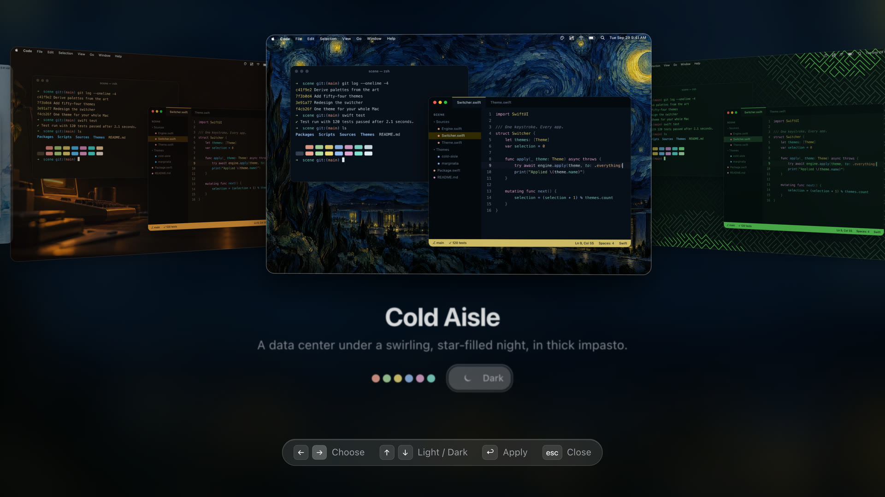
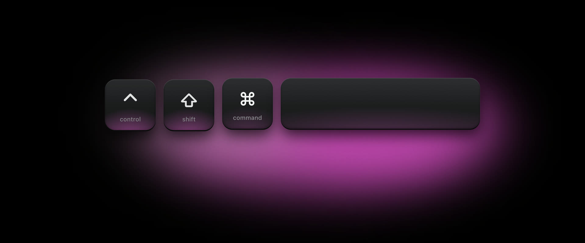
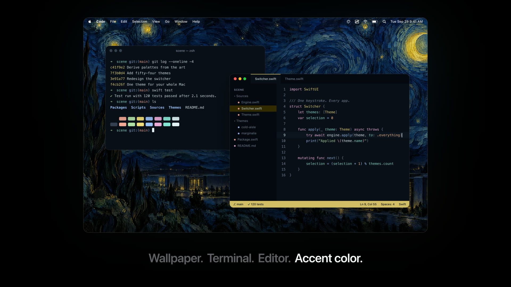
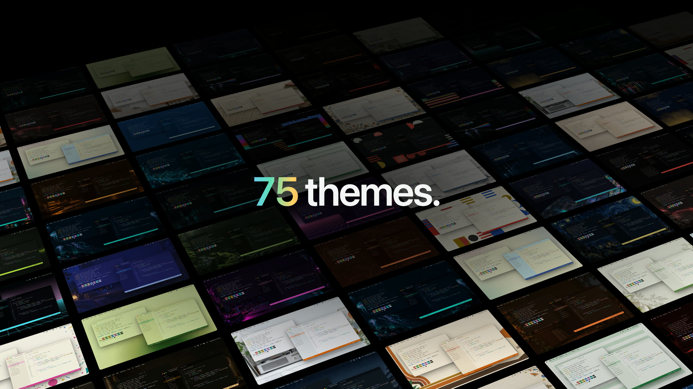

<h1 align="center">Scene</h1>

<h3 align="center">One theme for your whole Mac.</h3>

<p align="center">
  
</p>

Scene gives your desktop, terminals, and code editors one theme in one step, the way [Omarchy](https://omarchy.org) does on Linux. It changes the wallpaper, Light/Dark, and the accent color, your terminal (Ghostty, iTerm2, kitty, Alacritty, Warp, or Terminal), your editor (VS Code, Cursor, Zed, Xcode, Neovim, Helix, and more), and tools like tmux and bat, all together. It can put your original setup back.

## Switch from anywhere

<p align="center">
  
</p>

Press ⌃⇧⌘Space to show your themes over every screen. It is Omarchy's theme menu key, with ⌘ as Super. ← → choose a theme, ↑ ↓ switch between Light and Dark, ↩ applies it, and Esc closes. Type a name to narrow the list. Your favorites come first.

## Three backgrounds for every look

<p align="center">
  
</p>

Each theme has three backgrounds for its dark look and three for its light look. Pick one on the theme's page, which shows the theme on its own wallpaper, in its own light or dark look. Press ⌃⌥⌘Space to show the next one, like Omarchy's Super + Ctrl + Space. It changes only the wallpaper, and Undo brings the last one back.

## See every change first

<p align="center">
  
</p>

Before a theme touches anything, Scene lists each app and every file and setting it will change. Turn an app off to leave it alone. Undo goes back to the previous theme. Restore Original Setup puts back everything Scene changed and keeps the changes you made yourself.

## What it themes

<p align="center">
  
</p>

| | Apps | How |
|---|---|---|
| Desktop | Wallpaper, Light/Dark, JankyBorders | `NSWorkspace`; System Events, or a private call; one marked line in `bordersrc` |
| macOS look | Accent color, icon & widget style | Private calls in a helper, on tested macOS builds only (experimental) |
| Terminals | Ghostty, iTerm2, kitty, Alacritty, Warp, Terminal | A Scene theme file and one marked include or import line; an iTerm2 Dynamic Profile; a Terminal profile copied from your default one |
| Editors | VS Code, Cursor, VSCodium, Windsurf, Zed, Xcode, Neovim, Helix | A generated theme extension or theme file and one settings key; Xcode themes keep your fonts; a Neovim plugin file and a JSON data file |
| Command-line tools | tmux, bat and delta, btop | A theme file and one marked include line or config key |

Slack, Discord, Safari, Chrome, and Raycast cannot be themed by other apps. Set them to follow the system, and they switch with Light/Dark.

## Install

There is no download yet. Build Scene from a clone:

```sh
git clone https://github.com/InsaneArts/Scene.git
cd Scene
./Scripts/package_app.sh
open build/Scene.app
```

Requirements:

- macOS 14 or newer
- Xcode 26 or newer, to build
- For accent color and icon style, a macOS build that Scene has tested (now macOS 26.6.2). Settings can allow other builds.

Scene keeps running after you close its window, so the shortcuts keep working. Turn on Open Scene at login in Settings to keep them after a restart.

## Remove

1. In Scene, open History and click Restore Original Setup.
2. In Settings, turn off Open Scene at login. Then quit Scene and delete it.
3. Delete its data and settings:

```sh
rm -rf ~/Library/Application\ Support/Scene
defaults delete com.insanearts.scene
```

## Make a theme with an AI agent

A skill is a folder of instructions that an AI coding agent loads when a task needs it. Scene's skill, [`create-scene-theme`](skills/create-scene-theme), teaches Claude Code, Codex, and other agents that read `SKILL.md` files to make a complete Scene theme: a palette for each look, three wallpapers per look, and the macOS accent and icon style.

Install it with the [`skills`](https://github.com/vercel-labs/skills) command, which needs Node:

```sh
npx skills add InsaneArts/Scene --skill create-scene-theme -g
```

It finds the coding agents on your Mac and installs the skill for them. `-g` puts it in your home folder, so it works in every project. To choose the agents yourself, add `-a claude-code` or `-a codex`. `npx skills update` gets a newer version, and `npx skills remove create-scene-theme` removes it. Without Node, copy [`skills/create-scene-theme`](skills/create-scene-theme) into your agent's skills folder: `~/.claude/skills/` for Claude Code, or `~/.codex/skills/` for Codex.

Then ask your agent for a theme, for example "Make a Scene theme of a foggy harbor at dawn, in dark and light." The agent asks only what it doesn't know yet, designs a readable palette, and finds or makes three wallpapers per look. Then it checks the theme, builds it, and installs it with Scene's command line:

```sh
/Applications/Scene.app/Contents/MacOS/Scene --check-theme draft.json
/Applications/Scene.app/Contents/MacOS/Scene --build-theme draft.json my-theme --install
```

The theme shows in Scene's sidebar. The agent uses the same draft and checks as the Theme Maker, so its theme also opens in the Theme Maker for changes by hand. The built folder has a README with every credit, so you can put it on GitHub as it is, and anyone can install it with Add Theme → Install from GitHub. The skill needs a Scene that has the Theme Maker. It checks this first, and stops if Scene is older.

## Themes

<p align="center">
  
</p>

Scene comes with 75 themes. 21 are built from Omarchy's palettes, from Tokyo Night to Catppuccin, Gruvbox, and Rosé Pine. The other 54 are Scene's own, drawn from computing, science, and design: Phosphor, Amber, Mainframe, Teletext, Blueprint, Deep Field, Primary, Safelight, and more, 19 of them with a light look. Four remix old painting styles with computing, and take their colors from their paintings: Cold Aisle (a data center under a swirling starry sky), Deprecated (a Dutch still life of floppy disks and a guttering candle), Rain Bridge (a woodblock rain scene), and Marginalia (bugs in the margins of a manuscript).

The 75 are only a start. Open any theme in the Theme Maker to make your own version, or start a new one with Add Theme → New Theme…, and make as many as you want. If you make something beautiful and want others to install it, make it with the [agent skill](#make-a-theme-with-an-ai-agent) and put its folder on GitHub. Anyone can then install it with Add Theme → Install from GitHub.

## Development

```sh
open Scene.xcodeproj    # ⌘R runs the app, ⌘U runs the tests
./Scripts/test.sh       # the same 174 tests from the command line
```

To make a theme, use the `scene-theme` skill in `.claude/skills/`. The core is a local package, `Packages/SceneKit`. [docs/ARCHITECTURE.md](docs/ARCHITECTURE.md) explains how the code is written, [docs/DEVELOPMENT.md](docs/DEVELOPMENT.md) how to build, test, and release it, and [docs/STATUS.md](docs/STATUS.md) what is done and what is open. Agents start at [AGENTS.md](AGENTS.md).

## Credits

Palettes: [Omarchy](https://github.com/omacom/omarchy) v4.0.4 (MIT), [rose-pine/palette](https://github.com/rose-pine/palette), and [sainnhe/gruvbox-material](https://github.com/sainnhe/gruvbox-material).
